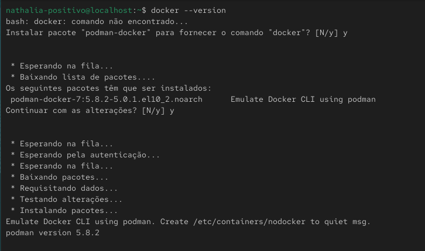
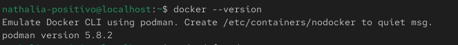
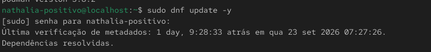
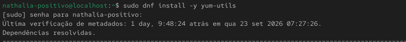
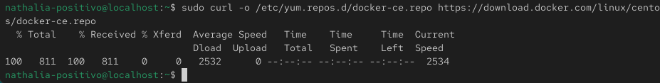

## Laboratório utilizando uma VM Oracle Linux

### Fazer um agendamento para restartar o serviço do docker e gravar o log do horário que foi restartado.

#### Esta atividade apresentará todo o processo, desde a instalação do Docker até a configuração e o agendamento solicitado.

### Passo 1 — Verificar instalação do docker na VM

```bash
docker --version
```


Após a instalação confirmar se está instalado

```bash
docker --version
```


Foi verificado que as dependências não estavam instaladas, o pacote podman-docker foi instalado posteriormente

**Obs: O Podman é uma ferramenta de código aberto criada pela Red Hat para criar, gerenciar e executar contêineres e imagens, funcionando como uma alternativa direta ao Docker**

### Passo 2 — Atualizar o sistema

```bash
sudo dnf update -y
```


### Passo 3 — Instale as ferramentas de utilitáriosAdicione o pacote yum-utils para gerenciar os repositórios

```bash
sudo dnf install -y yum-utils
```


### Passo 4 — Adicionar o repositório do Docker

```bash
sudo curl -o /etc/yum.repos.d/docker-ce.repo https://download.docker.com/linux/centos/docker-ce.repo
```



### Passo 5 - Iniciar o Docker
```bash
sudo systemctl enable --now docker
```

