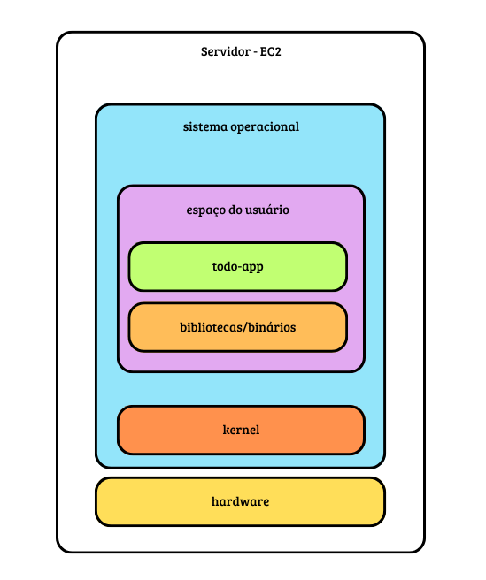

# Docker 🐋

É uma plataforma aberta para desenvolver, enviar e executar aplicações.

Separa a aplicação da infraestrutura.

Reduz o atraso entre escrever código e executá-lo em produção.

Tudo isso é realizado através de um contêiner.

## O que é uma aplicação?
Aplicação é a utilização prática de algo, seja uma teoria, um conceito ou, mais comumente em tecnologia, um programa de software projetado para realizar uma tarefa específica. No contexto de TI, pode ser um programa de computador, um aplicativo de celular ou uma aplicação web que o usuário acessa por meio de um navegador para diversas finalidades, como redes sociais ou realizar compras,

Em resumo uma aplicação

* Resolve um problema
* Tem uma finalidade prática

 #### Exemplos:
- Instagram
- Shopee
- Spotify

### O que compõe uma aplicação?
- Código fonte
- Dependências

### Dependências
#### Configurações internas 
* Variáveis de ambiente
* Arquivos de configuração

#### Bibliotecas
* Trechos de códigos prontos que são importados

#### Serviços externos
* Banco de dados
* Sistema de autenticação
* Mensageria
* Cache(Redis)

#### Sistema Operacional
* Espaço do usuário
* Kernel

#### Hardware
* CPU
* Memória
* Armazenamento
* Rede

### Arquitetura
 

## Contêiner
Os conteiners são uma tecnologia que permite que aplicações sejam empacotadas e isoladas com todo o seu runtime. Isso facilita a manutenção de um comportamento e funcionalidade consistentes ao migrar a aplicação em containers entre ambientes (desenvolvimento, teste, produção) e em nuvens públicas, privadas, híbridas e on-premise. Como eles são leves e portáteis, os containers podem ser usados para acelerar o desenvolvimento e atender às demandas empresariais conforme elas surgem.

## OpenShift 
Orquestrador de contâiners - Provisiona e remove contâiners de acordo com a necessidade

## Kubernets
Orquestrador de contâiners - Provisiona e remove contâiners de acordo com a necessidade

## Cluster
Agrupamento de contâiners

## Diferenças entre contêiners e VMs

A principal diferença é que máquinas virtuais (VMs) virtualizam um hardware físico inteiro e rodam um sistema operacional completo, enquanto contêineres compartilham o núcleo (kernel) do sistema operacional do host e virtualizam apenas a camada de software da aplicação.

Principais Comparações

#### Tamanho e Peso:
-  VMs: Ocupam gigabytes de espaço, pois cada uma carrega seu próprio sistema operacional.
-  Contêineres: Ocupam poucos megabytes, contendo apenas o código e as dependências essenciais para rodar o programa.
  
#### Velocidade e organização:
-  VMs: Levam minutos para ligar e inicializar todo o sistema operacional.
-  Contêineres: Iniciam em questão de segundos (ou frações de segundo) por serem apenas processos isolados.
  
#### Isolamento e Segurança:VMs: Oferecem isolamento total de hardware, sendo mais seguras para ambientes críticos ou múltiplos sistemas operacionais diferentes.
- Contêineres: Compartilham o mesmo kernel, o que reduz o isolamento e apresenta um risco maior se o host for comprometido.

#### Gerenciamento:
- VMs: Usam um hipervisor (como VMware ou VirtualBox) para gerenciar o hardware virtual.
- Contêineres: Usam um motor de execução (como Docker) integrado ao sistema operacional.

#### Quando usar contêineres vs. máquinas virtuais

**Configuração do ambiente**

As **máquinas virtuais** dão aos desenvolvedores mais controle sobre o ambiente da aplicação. Eles podem instalar manualmente o software do sistema, fazer instantâneos dos estados de configuração e restaurá-los a um estado anterior se necessário. Elas são úteis para ideação e experimentação ou para testar diferentes ambientes para melhorar a performance da aplicação.

Os **contêineres** fornecem definições estáticas das configurações depois que as melhores foram selecionadas.

**Velocidade de desenvolvimento do software**
Máquinas virtuais são sistemas de pilha completa e podem ter construção e regeneração trabalhosas. Qualquer modificação demora para ser validada e é necessário regenerar o ambiente.

**Contêineres** são a melhor escolha se você deseja construir, testar e lançar novos recursos com frequência. Como eles incluem apenas software de alto nível, são rápidos para modificar e fazer iterações.

#### Escalabilidade

**Máquinas virtuais** ocupam mais espaço de armazenamento e requerem o provisionamento de mais hardware em seu datacenter on-premises. Alternar para instâncias na nuvem reduz custos, mas migrar todo o ambiente traz desafios próprios.

**Contêineres** ocupam menos espaço e são mais fáceis de escalar. Mais importante, **contêineres** fornecem controle granular da escalabilidade da aplicação ao permitir o uso de **microsserviços**. 

**Microsserviços** são uma abordagem arquitetônica e organizacional do desenvolvimento de software na qual o software consiste em pequenos serviços independentes que se comunicam usando APIs bem definidas. Contêineres permitem escalar microsserviços individuais se necessário.

### Diferenças entre Docker e Kubernetes
Docker - execução de aplicações em contêiners de forma isolada em computadores, ambientes de nuvem, data-centers, etc. Criação e execução de contêiners e imagens de contêiners.
Kubernetes - Gerenciamento de contêiners, orequestrar a escalabilidade
